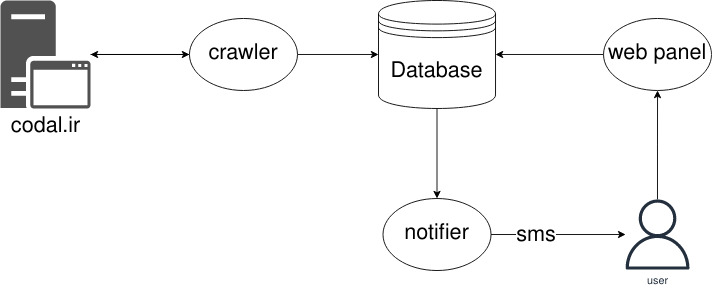

# کدالر
در این پروژه کوشیده شده تا سامانه‌ای مینیمال برای مدیریت و اطلاع رسانی سبد نمادهای بورسی هر فرد طراحی کنیم و در هنگام انتشار یک اطلاعیه در کدال (codal.ir) وابسته به سبد نمادهای کاربر یک اطلاعیه به صورت پیامک برای کاربر ارسال شود.

# طرح کلی
پروژه از ۳ بخش اساسی تشکیل می‌شود که در بخش ابتدایی crawler می‌کوشد همه اطلاعیه‌های جدید سایت کدال را جمع‌آوری و در دیتابیس ذخیره کند، بخش دوم پنل کاربری خواهد بود که وظیفه ذخیره و ویرایش سبد هر کاربر را دارد و ساب‌سیستم سوم هم سرویسی که در بازه‌های زمانی مشخص سبد کاربران را بررسی و با توجه به اطلاعیه‌های جدید برای هر کاربر پیامکی ارسال می‌کند.

# تکنو‌لوژی 
در این پروژه استک کلی پایتون ۳.۹ خواهد بود و دیتابیس برای سادگی از sqlite استفاده خواهد شد، در قسمت پنل از فلسک استفاده می‌شود و برای ارسال پیامک از api یکی از سایت‌های ارسال پیامک استفاده خواهد شد. فرآیند توسعه با گیت مدیریت و در گیتهاب منتشر می‌شود، پروژه نهایتا داکر ایمیج شده و در سروری لینوکسی دیپلوی می‌شود و از طریق دامنه در دسترس خواهد بود.

